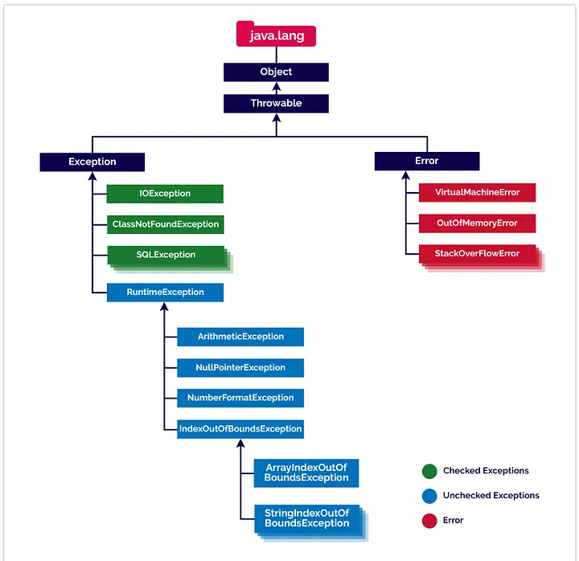
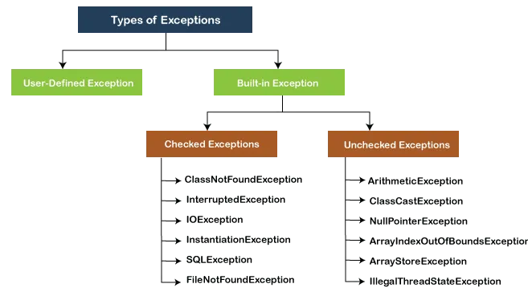

## Aulas 64 a 66 - Associação unidirecional

### 1. Exemplo um para muitos:

~~~
public class Player {
    private String name;
    private String position;
    private int age;

    /* Muitos jogadores têm apenas um clube */
    private Team team;
    
    ...
    
}
~~~

#### Os jogadores podem compartilhar do mesmo clube/time, mas só poderão ter apenas um. Ao contrário de um clube, que pode ter muitos jogadores associados a ele.

### 2. Exemplo muitos para um:

~~~
public class School {
    private String name;
    private String director;
    private Student[] students;

    ...
    
    @Override
    public String toString() {
        return "School{" +
                "name='" + name + '\'' +
                ", director='" + director + '\'' +
                ", students=" + Arrays.toString(students) +
                '}';
    }
    
}
~~~

#### Uma escola pode ter múltiplos alunos associados a ela, mas um estudante só pode estar matriculado numa escola.

---
## Aulas 95 a 100 - Destrinchando exceções

### Error x Exception:

- A maioria dos casos de erros não são causados pelo nosso programa estes são devido à falta de recursos do sistema e estes não são recuperáveis.
- A maioria dos casos de exceções são causadas pelo nosso programa e estes são recuperáveis.

### Tipos de exceções:

#### Checked:

- São lançadas em tempo de compilação e herdam da Classe Exception.

#### Unchecked:

- São lançadas em tempo de execução e herdam da Classe RuntimeException.

